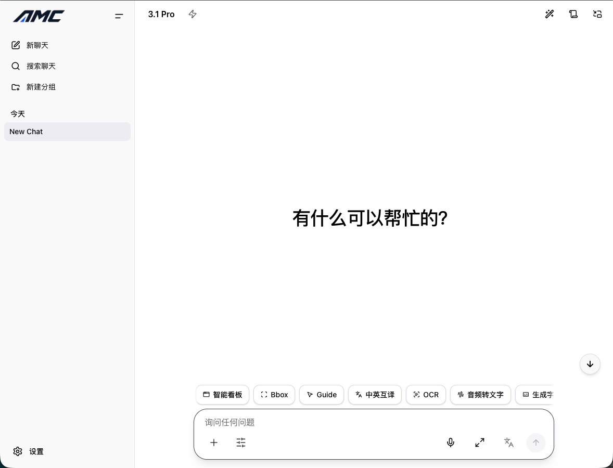

# AMC WebUI

<p align="center">
  <a href="./README.md">中文</a> | <a href="./README.en.md">English</a>
</p>

<div align="center">

  <p>
    <strong>An all-in-one Model Console WebUI for Google Gemini API and modern AI workflows.</strong>
  </p>

  <p>
    <a href="https://all-model-chat.pages.dev/" target="_blank">
      
    </a>
    <a href="https://github.com/yeahhe365/AMC-WebUI/releases" target="_blank">
      
    </a>
    
  </p>

  <p>
    
    
    
    
    
  </p>

</div>

---

## Preview

<p align="center">
  
</p>

## Overview

**AMC WebUI** is a React 18 based all-in-one Model Console WebUI built around the Google Gemini API. It is designed as a **Local-First** AI workspace: conversations are stored in the browser's IndexedDB by default, while an optional standalone backend lets you host Gemini credentials server-side and proxy API requests safely in trusted deployments.

The project currently focuses on one main application shape: a **Vite + React SPA**.

- **Standard mode**: local Vite development and static builds for day-to-day development or static hosting.
- **Docker mode**: a `web + api` deployment where the frontend calls `/api/gemini/*` and `/api/live-token`.
- **Static frontend + standalone API mode**: deploy the frontend to Pages/CDN and run the Node API service separately.

---

## Features

### Deep Thinking

- Visualizes reasoning output for Gemini 3.0 / 3.1 / 2.5 family models.
- Supports token budgets and reasoning levels: Minimal, Low, Medium, and High.
- Streams model reasoning in real time when supported.

### Realtime Audio and Video

- Two-way realtime streaming with voice conversations.
- Screen sharing and visual understanding workflows.
- Audio visualization based on AudioWorklet.

### Smart Canvas

- Detects code blocks and renders interactive HTML previews.
- Supports ECharts, Mermaid, and Graphviz diagrams.
- Includes an automatic Canvas generation mode with configurable trigger models.

### Advanced File Handling

- Browser-side audio preprocessing and compression to reduce upload cost.
- ZIP and folder import for codebase context.
- Supports images, PDFs, videos, audio files, text files, and more.
- Per-file-type control over Gemini Files API upload vs direct Base64 upload.
- Adjustable file resolution presets: Low, Medium, High, and Ultra.

### Productivity Workflow

- Deep search powered by Google Search with planned search tasks and citations.
- URL context ingestion for adding web pages to conversations.
- Local Python sandbox based on Pyodide (WASM):
  - Bundled scientific stack such as numpy, pandas, matplotlib, scipy, and scikit-learn.
  - Automatic dependency detection and installation.
  - File mounting and generated file download support.
  - Automatic capture of matplotlib chart output.
- TTS with 30+ voices.
- Speech transcription through Gemini models.
- Imagen 4.0 image generation with Fast, Standard, and Ultra tiers.

### API Management

- Multiple API key rotation for distributing load.
- Custom Gemini API proxy support through the native `baseUrl` configuration in the SDK.

### Internationalized UI

- Chinese, English, and system language modes.
- Translated UI across chat, settings, sidebars, shortcuts, and related workflows.

### PWA

- Web App Manifest, Service Worker, and install/update prompts.
- Installable on desktop and mobile.
- Offline application shell support. Model responses and sync still require network access.
- Picture-in-Picture mode support.

### Usage and Pricing Logs

- Strict pricing mode: prices are shown only when stored usage data can reproduce official billing precisely.
- New chat, TTS, transcription, and some image generation requests record richer billing metadata.
- Text-only chats supplement `TEXT -> TEXT` modal evidence locally, so pricing can be shown for supported Gemini text models.
- Historical records with incomplete pricing evidence continue to show `-`.

### More

- Cross-tab synchronization through Web Locks.
- Custom keyboard shortcuts.
- Configurable safety settings across harassment, hate speech, sexual content, dangerous content, and civic integrity categories.
- Onyx and Pearl themes with system theme support.
- Import/export for chat history, settings, and scenarios.
- Session grouping, full-text session search, and a developer log panel.

---

## Quick Start

### Option 1: Standard Development

```bash
git clone https://github.com/yeahhe365/AMC-WebUI.git
cd AMC-WebUI

npm install
npm run dev
```

Open `http://localhost:5173`, then add your Gemini API key in **Settings -> API Configuration**.

For local frontend development, you can also create `.env.local` in the repository root:

```bash
GEMINI_API_KEY=your_api_key_here
```

### Option 2: Docker Compose

The Docker deployment contains two services:

- `web`: Nginx serves the frontend and proxies `/api/*` to the API service.
- `api`: Node service for `/api/gemini/*` and `/api/live-token`.

```bash
npm run build
docker compose up -d --build
```

The default URL is `http://localhost:8080`. Stop it with:

```bash
docker compose down
```

Notes:

- The `web` image packages the already built local `dist/` directory.
- After frontend changes, run `npm run build` before rebuilding the Docker services.

> Security note
>
> The `web + api` proxy setup is intended for trusted self-hosted deployments. It hides the server-side `GEMINI_API_KEY` from the browser and forwards requests, but it is not a complete public multi-user API gateway. Add authentication, quotas, rate limiting, abuse protection, audit logging, and tenant isolation before exposing it publicly.

### Runtime Configuration and Environment Variables

| Variable | Purpose | Public | Default |
| :--- | :--- | :--- | :--- |
| `GEMINI_API_KEY` | Real Gemini API key used by the `api` service | Server only | Empty, required in production |
| `PORT` | Port used by the API service | Server only | `3001` |
| `GEMINI_API_BASE` | Upstream Gemini API base URL | Server only | `https://generativelanguage.googleapis.com` |
| `ALLOWED_ORIGINS` | Comma-separated CORS allowlist for cross-origin deployments | Server only | Empty |
| `RUNTIME_SERVER_MANAGED_API` | Enables server-managed API mode by default in the frontend | Public runtime config | `true` |
| `RUNTIME_USE_CUSTOM_API_CONFIG` | Enables custom API configuration by default | Public runtime config | `true` |
| `RUNTIME_USE_API_PROXY` | Enables API proxy mode by default | Public runtime config | `true` |
| `RUNTIME_API_PROXY_URL` | Default Gemini proxy URL for the frontend | Public runtime config | `/api/gemini` |
| `RUNTIME_LIVE_API_EPHEMERAL_TOKEN_ENDPOINT` | Default Live API token endpoint | Public runtime config | `/api/live-token` |

The `RUNTIME_*` values are written into `runtime-config.js` at container startup and are readable by the browser. Only put public configuration there. Keep `GEMINI_API_KEY` in the backend environment only.

### Option 3: Cloudflare Pages + Standalone API

You can deploy the frontend to Cloudflare Pages and run `server/` as a separate Node service on a VM, container platform, or serverless container runtime.

1. Build and publish the frontend `dist` directory:

```bash
npm run build
```

2. Build and start the standalone API service:

```bash
npm run build:api
npm run start:api
```

3. Point the frontend runtime config to your public API URL:

```text
RUNTIME_API_PROXY_URL=https://your-api.example.com/api/gemini
RUNTIME_LIVE_API_EPHEMERAL_TOKEN_ENDPOINT=https://your-api.example.com/api/live-token
```

4. Set `GEMINI_API_KEY` in the backend environment and optionally set `ALLOWED_ORIGINS=https://your-pages-domain.pages.dev`.

#### Optional: Use AIStudioToAPI as a Gemini-Compatible Backend

If you want to use a Google AI Studio web account as the API source, you can also try deploying [AIStudioToAPI](https://github.com/iBUHub/AIStudioToAPI) as a third-party Gemini-compatible backend. It exposes Gemini Native API style `/v1beta/*` endpoints and can be used as the custom API proxy for AMC WebUI.

Example:

```text
RUNTIME_API_PROXY_URL=https://your-aistudio-to-api.example.com/v1beta
```

You can also open **Settings -> API Configuration**, enable custom API configuration and API proxy, then enter the AIStudioToAPI Gemini-compatible Base URL, such as `http://localhost:7860/v1beta`. The API key entered in AMC WebUI should match one of the `API_KEYS` configured for the AIStudioToAPI deployment.

Note: AIStudioToAPI is a third-party project, so review its account login, authentication, rate limiting, and public exposure risks before use. It can replace the Gemini API proxy source, but it does not provide AMC WebUI's built-in `/api/live-token` endpoint. Realtime Live API flows that need server-issued ephemeral tokens still require a compatible implementation.

### Build and Preview

```bash
npm run build
npm run preview
```

### Quality Checks

```bash
npm run typecheck
npm run lint
npm run test
npm run knip
npm run build

# Or run the full verification pipeline
npm run verify
```

To verify Gemini Code Execution related behavior:

```bash
npm run test:code-execution
```

This covers:

- MIME and upload strategy handling for text, CSV, and code files.
- Code Execution request construction and multi-turn history replay.
- Streaming `thoughtSignature` preservation.
- Live API display for `codeExecutionResult.output`.

For a manual API integration check with a real Gemini key:

```bash
GEMINI_API_KEY=your_key_here npm run verify:code-execution:api
```

Optional variable:

- `CODE_EXECUTION_MODEL`: override the default model, which is `gemini-2.5-flash`.

---

## Architecture

| Layer | Stack |
| :--- | :--- |
| Core framework | React 18 + TypeScript 5.5 + Vite 5 |
| Styling | Tailwind CSS 4 + CSS variable based theme system |
| Persistence | Native IndexedDB wrapper with Web Locks for cross-tab write safety |
| Gemini SDK | `@google/genai` 1.2+ for streaming, non-streaming, file upload, image generation, TTS, and transcription |
| Audio | AudioWorklet API plus browser Worker based audio preprocessing and compression |
| Rendering | React-Markdown + KaTeX + Highlight.js + Mermaid + Graphviz |
| Python sandbox | Pyodide (WASM) in a Web Worker with scientific packages |
| API proxy | Gemini proxy through `@google/genai` `httpOptions.baseUrl` |
| PWA | Web App Manifest + install/update event handling |
| Deployment | Vite static build, Docker Compose (`web + api`), or Cloudflare Pages + standalone API |

When using server-managed API mode in production, the frontend calls:

- `/api/gemini/*`
- `/api/live-token`

---

## Project Structure

```text
AMC-WebUI/
├── src/                        # Frontend source code (Vite SPA)
│   ├── components/             # UI components for chat, messages, layout, settings, modals, and more
│   ├── hooks/                  # App, chat, input, data management, live API, and UI hooks
│   ├── services/               # Gemini, Pyodide, API, logging, and infrastructure services
│   ├── stores/                 # Zustand stores for chat, settings, and UI state
│   ├── utils/                  # Export, session, IndexedDB, Markdown, file, and media utilities
│   ├── runtime/                # Runtime config loading and public config mapping
│   ├── contexts/               # I18n, WindowContext, and related providers
│   ├── constants/              # Models, prompts, shortcuts, themes, and app constants
│   ├── types/                  # TypeScript types
│   ├── styles/                 # Global styles, animations, and Markdown styles
│   ├── App.tsx                 # App root component
│   └── index.tsx               # React mount entry
├── server/                     # Standalone Node API for /api/gemini/* and /api/live-token
├── public/                     # Static assets and runtime-config.js template
├── e2e/                        # Playwright tests
├── docs/                       # Plans, specs, and documentation
├── docker/                     # Deployment helper scripts
├── vite.config.ts              # Vite config
├── playwright.config.ts        # E2E config
├── vitest.config.ts            # Unit and integration test config
├── eslint.config.js            # ESLint config
├── knip.json                   # Unused file/export analysis config
├── package.json                # Dependencies and scripts
└── docker-compose.yml          # web + api deployment entry
```

---

## Supported Models

| Type | Models |
| :--- | :--- |
| Gemini 3.x | `gemini-3-flash-preview`, `gemini-3.1-flash-live-preview`, `gemini-3.1-flash-lite-preview`, `gemini-3.1-pro-preview` |
| Gemma 4 | `gemma-4-31b-it`, `gemma-4-26b-a4b-it` |
| Imagen 4.0 | `imagen-4.0-fast-generate-001`, `imagen-4.0-generate-001`, `imagen-4.0-ultra-generate-001` |
| Image generation | `gemini-2.5-flash-image`, `gemini-3-pro-image-preview`, `gemini-3.1-flash-image-preview` |
| TTS | `gemini-3.1-flash-tts-preview` with 30+ voices |

---

## Contributing

Contributions are welcome.

1. Report issues through [GitHub Issues](https://github.com/yeahhe365/AMC-WebUI/issues).
2. Fork the repository, create a feature branch, and open a Pull Request.
3. Support ongoing development by starring the project or visiting [Afdian](https://afdian.com/a/gemini-nexus).

---

## Related Community

- [Linux.do](https://linux.do/): an active Chinese tech community focused on AI, software development, resource sharing, and frontier technology discussions. Its vision is "a new ideal community", and its community culture emphasizes sincerity, friendliness, unity, and professionalism.

---

<div align="center">
  <p>Developed with :heart: by <strong>yeahhe365</strong></p>
</div>
