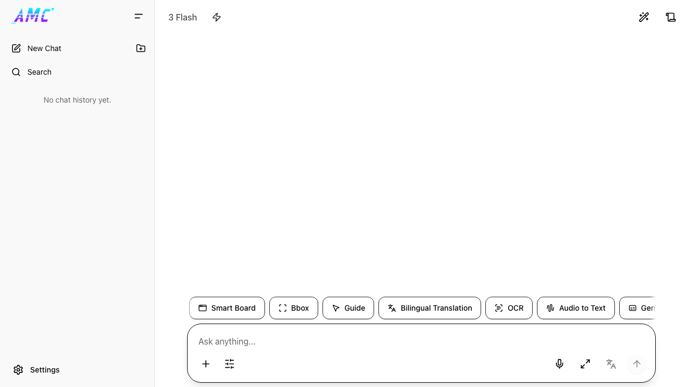

# All Model Chat

<div align="center">

  <p>
    <strong>基于 Google Gemini API 的全能 AI 交互工作台</strong>
  </p>

  <p>
    <a href="https://all-model-chat.pages.dev/" target="_blank">
      
    </a>
    <a href="https://github.com/yeahhe365/All-Model-Chat/releases" target="_blank">
      
    </a>
    
  </p>

  <p>
    
    
    
    
    
  </p>

</div>

---

## 界面预览

<p align="center">
  
</p>

## 项目简介

**All Model Chat** 是一款基于 React 18 的 AI 交互工作台，深度集成 Google Gemini 系列模型。项目坚持 **Local-First** 原则：聊天数据默认存储于浏览器 IndexedDB，在保障隐私的同时提供流畅体验；同时支持新增的独立后端部署模式，用于服务端托管 Gemini 密钥与代理请求。

当前仓库围绕 **Vite + React SPA** 作为唯一主线构建形态：
- **标准模式**：本地通过 Vite 开发 / 构建，适合日常开发与静态部署
- **Docker 部署模式**：`web + api` 双服务部署，前端走 `/api/gemini/*` 与 `/api/live-token`
- **静态前端 + 独立 API 模式**：前端部署到 Pages/CDN，后端单独托管 Node API 服务

---

## 核心功能

### 深度推理 (Thinking)
- 支持 Gemini 3.0 / 3.1 / 2.5 系列模型的思维链可视化
- 可设置 **Token 预算** 或 **推理等级** (Minimal / Low / Medium / High)
- 实时查看 AI 的逻辑演算过程

### 实时音视频 (Live API)
- 双向实时流式交互，支持语音通话
- 屏幕共享与视觉识别
- 音频可视化 (AudioWorklet API)

### 智能 Canvas
- 代码块自动识别并渲染为交互式 HTML 预览（自动全屏）
- 支持 ECharts 图表渲染
- 支持 Mermaid 流程图与 Graphviz 图渲染
- 自动 Canvas 生成模式（可配置触发模型）

### 高级文件处理
- 浏览器端音频预处理与压缩流程，尽量降低音频上传的 Token 与带宽消耗
- 支持 ZIP / 文件夹拖入，自动解析代码库结构
- 支持图片、PDF、视频、音频、文本等多种文件类型
- 可配置各文件类型使用 Gemini Files API 还是直接 Base64 上传
- 文件分辨率可调（Low / Medium / High / Ultra）

### 生产力工具链
- **深度搜索**：聚合 Google Search，自动规划搜索任务并提供精准引用
- **URL 上下文**：自动抓取 URL 内容作为对话上下文
- **本地 Python 沙箱**：基于 Pyodide (WASM) 的浏览器端 Python 运行环境
  - 预装 numpy、pandas、matplotlib、scipy、scikit-learn 等科学计算库
  - 自动检测代码依赖并安装
  - 支持文件挂载与生成文件下载
  - matplotlib 图表自动捕获输出
- **TTS 语音合成**：30+ 种语音可选
- **语音转录**：支持多种 Gemini 模型进行语音转文字
- **Imagen 4.0 图片生成**：支持 Fast / Standard / Ultra 三档，可配置宽高比与尺寸

### 企业级 API 管理
- **多 Key 轮询**：支持填入多个 API Key 自动分担压力
- **API 代理**：支持通过 SDK 原生 `baseUrl` 配置接入自定义 Gemini API 代理

### 多语言界面
- 支持中文 / 英文 / 跟随系统三种语言设置
- 覆盖所有 UI 组件（聊天、设置、侧边栏、快捷键等）

### PWA 支持
- 提供完整 Web App Manifest、Service Worker 与安装/更新提示
- 可安装为桌面/移动端应用，并支持离线打开应用 Shell
- 运行时接口请求保持网络优先，模型响应与同步能力仍需联网
- 支持画中画 (Picture-in-Picture) 模式

### 日志价格统计
- 日志与用量页采用“严格精确”模式：只有在已存储字段足以精确还原官方费用时才显示价格
- 新生成的聊天、TTS、转写与部分图片生成请求会记录更完整的计费元数据
- 纯文本聊天请求会在本地补齐 `TEXT -> TEXT` 模态证据，因此纯文本 `gemini-3.1-pro-preview`、`gemini-3-flash-preview` 与 `gemini-3.1-flash-lite-preview` 对话可显示价格
- 历史记录或缺少精确定价字段的请求会继续显示 `—`

### 多标签同步
- 基于 Web Locks API 的跨标签页数据同步
- 确保多标签页同时操作时数据一致性

### 自定义快捷键
- 内置快捷键系统，支持新建聊天、打开日志、切换模型、画中画等操作
- 所有快捷键均可自定义覆盖

### 安全设置
- 5 个安全过滤类别：骚扰、仇恨言论、色情内容、危险内容、公民诚信
- 每个类别可独立配置过滤级别（OFF / None / High / Medium / Low）

### 主题系统
- 内置 Onyx（暗色）、Pearl（亮色）主题
- 支持跟随系统主题自动切换

### 数据管理
- 完整的聊天记录导入 / 导出
- 会话分组管理
- 会话搜索（标题 + 内容全文搜索）
- 开发者日志面板（API 调用监控、Token 用量统计）

---

## 快速开始

### 方式一：标准开发模式

```bash
# 克隆仓库
git clone https://github.com/yeahhe365/All-Model-Chat.git
cd All-Model-Chat

# 安装依赖
npm install

# 启动开发服务器
npm run dev
```

访问 `http://localhost:5173`，在 **设置 -> API 配置** 中填入你的 Gemini API Key。

除了在界面中手动配置，也可在根目录创建 `.env.local`（仅前端开发模式使用）：

```bash
GEMINI_API_KEY=your_api_key_here
```

### 方式二：Docker Compose（推荐生产部署）

项目包含双容器部署：
- `web`：Nginx 托管前端静态资源，并反向代理 `/api/*` 到 `api` 服务
- `api`：Node 服务，提供 `/api/gemini/*` 代理与 `/api/live-token`

运行方式：

```bash
# 在仓库根目录
npm run build
docker compose up -d --build
```

默认访问 `http://localhost:8080`。如需关闭后台运行可执行 `docker compose down`。

说明：
- `web` 镜像默认直接打包宿主机已生成的 `dist/`，不再在容器内执行前端生产构建。
- 修改前端代码后，请先重新执行 `npm run build`，再执行 `docker compose up -d --build`。

> ⚠️ 安全边界说明
> 当前 `web + api` 代理方案定位为 **受信任/自托管环境**（trusted self-hosted deployment）。
> 它用于隐藏服务端 `GEMINI_API_KEY` 并转发请求，但**本身并不足以**作为公开互联网下“无鉴权多用户 API 网关”。
> 若要对公网开放，请额外引入鉴权、配额/限流、滥用防护、审计与租户隔离等能力。

### 运行时配置与环境变量

部署时请区分两类配置：

| 变量名 | 用途 | 公开性 | 默认值 |
| :--- | :--- | :--- | :--- |
| `GEMINI_API_KEY` | 后端调用 Gemini API 的真实密钥（`api` 服务读取） | **仅服务端** | 空（必须在生产环境提供） |
| `PORT` | `api` 服务监听端口 | 仅服务端 | `3001` |
| `GEMINI_API_BASE` | Gemini 上游地址（代理目标） | 仅服务端 | `https://generativelanguage.googleapis.com` |
| `ALLOWED_ORIGINS` | 逗号分隔 CORS 白名单（跨域部署时使用） | 仅服务端 | 空 |
| `RUNTIME_SERVER_MANAGED_API` | 前端默认启用服务端托管 API | **公开运行时配置** | `true` |
| `RUNTIME_USE_CUSTOM_API_CONFIG` | 前端默认启用“自定义 API 配置” | 公开运行时配置 | `true` |
| `RUNTIME_USE_API_PROXY` | 前端默认启用 API 代理 | 公开运行时配置 | `true` |
| `RUNTIME_API_PROXY_URL` | 前端默认 Gemini 代理地址 | 公开运行时配置 | `/api/gemini` |
| `RUNTIME_LIVE_API_EPHEMERAL_TOKEN_ENDPOINT` | 前端默认 Live token 端点 | 公开运行时配置 | `/api/live-token` |

说明：
- 上述 `RUNTIME_*` 会在容器启动时写入 `runtime-config.js`，可被浏览器读取，因此只能放“可公开”信息。
- `GEMINI_API_KEY` 只应存在于后端环境变量，不应写入前端构建产物、`runtime-config.js` 或浏览器设置备份。
- 前端在部署时默认依赖后端端点：`/api/gemini/*` 与 `/api/live-token`。

### 方式三：Cloudflare Pages（静态前端）+ 独立 API 服务

可将前端部署在 Cloudflare Pages，同时将 `server/` 独立部署到任意 Node 运行环境（VM、容器平台、Serverless 容器等）：

1. 前端（Pages）执行标准构建并发布 `dist`：
```bash
npm run build
```
2. 后端（独立服务）构建并启动：
```bash
npm run build:api
npm run start:api
```
3. 在前端运行时配置中将以下值指向后端公开地址（示例）：
```text
RUNTIME_API_PROXY_URL=https://your-api.example.com/api/gemini
RUNTIME_LIVE_API_EPHEMERAL_TOKEN_ENDPOINT=https://your-api.example.com/api/live-token
```
4. 在后端环境设置 `GEMINI_API_KEY`，并按需配置 `ALLOWED_ORIGINS=https://your-pages-domain.pages.dev`。

### 构建与预览

```bash
npm run build    # 构建生产版本
npm run preview  # 本地预览构建结果
```

### 质量检查

```bash
npm run typecheck
npm run lint
npm run test
npm run knip
npm run build

# 或者一次性执行
npm run verify
```

如果只想验证 Gemini Code Execution 相关链路，可以执行：

```bash
npm run test:code-execution
```

这个命令覆盖：
- 文本 / CSV / 代码文件的 MIME 与上传策略
- Code Execution 请求构造与多轮历史回放
- 流式 `thoughtSignature` 保留
- Live API 中 `codeExecutionResult.output` 展示

如果你想用真实 `GEMINI_API_KEY` 做一次手动联调检查，也可以执行：

```bash
GEMINI_API_KEY=your_key_here npm run verify:code-execution:api
```

可选环境变量：
- `CODE_EXECUTION_MODEL`：覆盖默认模型（默认 `gemini-2.5-flash`）

这个脚本会：
- 上传一个临时 CSV 文件，并显式使用 `text/csv`
- 发起一次启用 `codeExecution` 的请求
- 检查响应里是否同时出现 `executableCode` 和 `codeExecutionResult`
- 复用第一轮完整模型内容发起第二轮追问，验证多轮历史可继续使用

---

## 技术架构

| 层级 | 技术栈 |
| :--- | :--- |
| **核心框架** | React 18 + TypeScript 5.5 + Vite 5 |
| **样式方案** | Tailwind CSS 4 + CSS 变量主题系统 |
| **持久化层** | 原生 IndexedDB（db.ts 封装），支持 Web Locks 跨标签写锁 |
| **Gemini SDK** | @google/genai 1.2+，含流式 / 非流式消息、文件上传、图片生成、TTS、转录 |
| **音频引擎** | AudioWorklet API（实时流处理）+ 浏览器端 Worker 音频预处理 / 压缩流程 |
| **渲染引擎** | React-Markdown + KaTeX (公式) + Highlight.js (代码高亮) + Mermaid.js + Graphviz (viz.js) |
| **Python 沙箱** | Pyodide (WASM)，Web Worker 内执行，预装科学计算库 |
| **API 代理** | 基于 `@google/genai` SDK `httpOptions.baseUrl` 的 Gemini API 代理配置 |
| **PWA** | Web App Manifest + `beforeinstallprompt` / `appinstalled` 安装事件处理 |
| **部署形态** | Vite 标准构建 / Docker Compose（web+api）/ Cloudflare Pages + 独立 API |
生产部署若采用服务端托管 API，前端默认请求后端端点：
- `/api/gemini/*`
- `/api/live-token`

---

## 项目结构

```
All-Model-Chat/
├── src/                        # 前端应用源码（Vite SPA）
│   ├── components/             # UI 组件（chat / message / layout / settings / modals 等）
│   ├── hooks/                  # 业务 hooks（app / chat / chat-input / data-management / live-api / ui）
│   ├── services/               # Gemini / Pyodide / API / 日志等基础设施
│   ├── stores/                 # Zustand 状态（chat / settings / ui）
│   ├── utils/                  # 导出、会话、IndexedDB、Markdown、文件处理等工具
│   ├── runtime/                # 运行时配置读取与公开配置映射
│   ├── contexts/               # I18n / WindowContext 等上下文
│   ├── constants/              # 模型、提示词、快捷键、主题等常量
│   ├── types/                  # TypeScript 类型定义
│   ├── styles/                 # 全局样式、动画、Markdown 样式
│   ├── App.tsx                 # 应用入口组件
│   └── index.tsx               # React 挂载入口
├── server/                     # 独立 Node API（/api/gemini/* 与 /api/live-token）
│   ├── src/
│   └── tsconfig.json
├── public/                     # 静态资源与 runtime-config.js 模板
├── e2e/                        # Playwright 端到端测试
├── docs/                       # 计划、规范与文档
├── docker/                     # 部署辅助脚本
├── vite.config.ts              # Vite 配置（React、静态复制、手工分包）
├── playwright.config.ts        # E2E 配置
├── vitest.config.ts            # 单元/集成测试配置
├── eslint.config.js            # ESLint 配置
├── knip.json                   # 未使用文件/导出分析配置
├── package.json                # 前端依赖与脚本
└── docker-compose.yml          # web + api 双服务部署入口
```

---

## 支持的模型

| 类型 | 模型 |
| :--- | :--- |
| **Gemini 3.x** | gemini-3-flash-preview, gemini-3.1-flash-live-preview, gemini-3.1-flash-lite-preview, gemini-3.1-pro-preview |
| **Gemma 4** | gemma-4-31b-it, gemma-4-26b-a4b-it |
| **Imagen 4.0** | imagen-4.0-fast-generate-001, imagen-4.0-generate-001, imagen-4.0-ultra-generate-001 |
| **图片生成** | gemini-2.5-flash-image, gemini-3-pro-image-preview, gemini-3.1-flash-image-preview |
| **TTS** | gemini-3.1-flash-tts-preview (30+ 种语音) |

---

## 参与贡献

我们欢迎任何形式的贡献！

1. **报告问题**：提交 [GitHub Issue](https://github.com/yeahhe365/All-Model-Chat/issues)
2. **代码贡献**：Fork 仓库 -> 创建特性分支 -> 提交 Pull Request
3. **支持作者**：点个 **Star** 或前往 [爱发电](https://afdian.com/a/gemini-nexus) 支持持续开发

---

<div align="center">
  <p>Developed with :heart: by <strong>yeahhe365</strong></p>
</div>
